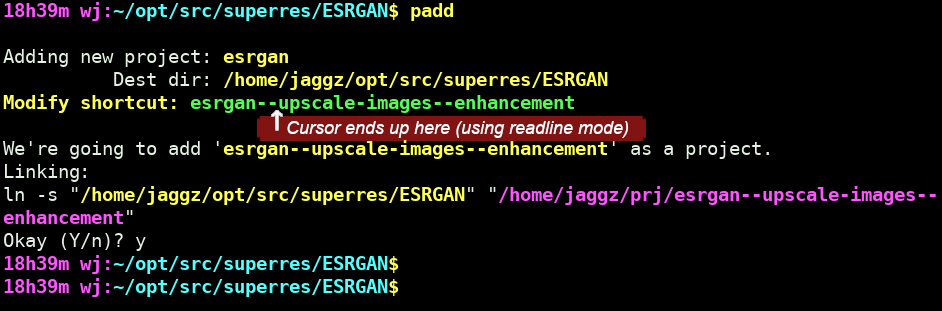
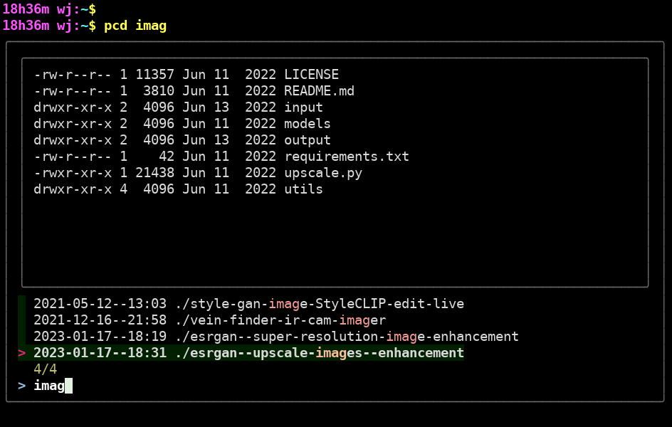

# Shell Project Directory Helpers

The main script, sourced from your shell rc, provides some functions, like:

* *padd*: Project add
* *pcd*: Change to a project (uses `fzf`. see screenshot)
* *pcdt*: Bash tab-completion version of pcd

After `padd` (adding) a project, you can then use `pcd` to change
to it from anywhere (`pcd` lets you change to any project dir).

(Alternatively, you can just `cd -P ~/prj/projectname` (or whatever you set the projects main folder to) to change to its folder.  -P tells cd to resolve the symlinks to get to the physical dir).

## Requirements
* fzf: If you want to use the `pcd` command. ([https://github.com/junegunn/fzf](https://github.com/junegunn/fzf))

## Installation

1. Clone repo, or otherwise include bash-dir-projects-helpers in your user's bin folder (or a system-wide bin folder if you want all users to use it).
1. Set `handydir_base=~/prj` to the folder of your choice. This is a folder that symlinks to your projects will be added to.
1. If you want to use pcd, it presently relies on `fzf` being installed, since it uses it to provide a list of projects, which you can type to filter, or you can type `pcd {pattern}` to start it up already filtered (and then filter it some more if you want).  FZF can be found at: https://github.com/junegunn/fzf **but it may be in your distro**.

## Usage

1. When you're in some project dir, just type `padd`
1. It will prompt you for some keywords, letting you edit the symlink name that'll be created.
1. Later, from anywhere, typing `pcd` or `pcd pattern` will invoke `fzf` to let you pick and change to the folder.
1. (You can see all the symlinks in your chosen project dir.)

## Additional notes:
* `bash-dir-projects-helpers` has some remnant code that's unused. It was when I was implementing it using bash tab completion for changing to the project dirs. This ended up being significantly less useful than fzf as the project selection.

